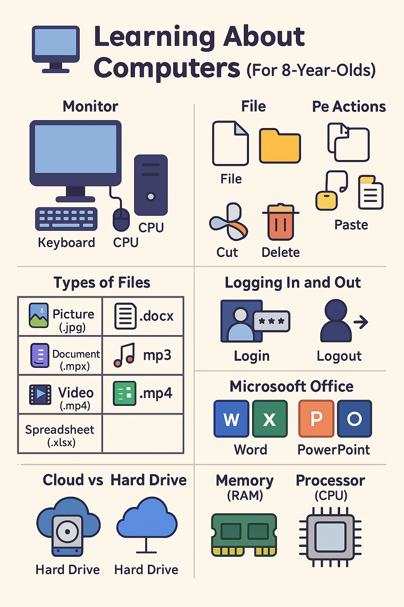

# 🖥️ Computer Basics for Kids (8-Year-Old Edition)

Welcome to the fun world of computers! Let’s learn what computers are and how they work in a way that's easy and fun.

---

## 💻 What Is a Computer?
A computer is like a super helper! It can:
- Show you videos
- Play games
- Help you type stories
- Solve math problems

---

## 🧠 Parts of a Computer:
- **Monitor**: Like a TV screen – shows you pictures and words.
- **Keyboard**: You use it to type letters and numbers.
- **Mouse**: Helps you click on things.
- **CPU (Brain)**: The part that does all the thinking and makes things work.

---

## 📁 Files and 📂 Folders

- A **file** is like a piece of paper – it can be a photo, story, video, or song.
- A **folder** holds many files, just like a school folder holds your papers.

### 🖱️ What Can You Do With Files?
- ✂️ **Cut**: Move the file somewhere else.
- 📋 **Copy**: Make another copy.
- 📥 **Paste**: Place the copied or cut file in a new place.
- 🗑️ **Delete**: Throw it away (but you can sometimes get it back from the Recycle Bin!).

---

## 📄 Different Types of Files

| File Type    | File Ending     | Used For               | Opens With             |
|--------------|------------------|-------------------------|-------------------------|
| Picture      | `.jpg`, `.png`   | Photos and drawings     | Photo Viewer, Paint     |
| Document     | `.docx`, `.pdf`  | Writing and reading     | Microsoft Word, Reader  |
| Music        | `.mp3`           | Listening to songs      | Music Player            |
| Video        | `.mp4`           | Watching shows or clips | Video Player            |
| Spreadsheet  | `.xlsx`          | Math and lists          | Microsoft Excel         |

---

## 🧰 What Is Microsoft Office?

- **Word**: Type letters, homework, and stories.
- **Excel**: Make tables and keep scores.
- **PowerPoint**: Make slides to explain things.
- **Outlook**: Send and receive emails.

---

## 🔐 Logging In and Logging Out

- **Login**: Like opening your secret box using a password.
- **Logout**: Like locking it when you’re done!

---

## ☁️ Cloud and Hard Drive

- **Hard Drive**: The computer’s cupboard. Files stay here.
- **Cloud**: A magic internet cupboard. You can open it from anywhere with internet!

---

## 🧠 Memory and Processor

- **Memory (RAM)**: Like your short-term memory. Helps the computer remember what you’re doing right now.
- **Processor (CPU)**: Like the brain. It does all the work fast!

---

🎉 Now you're a little computer whiz! Keep exploring and learning fun things on your computer — safely and smartly!
